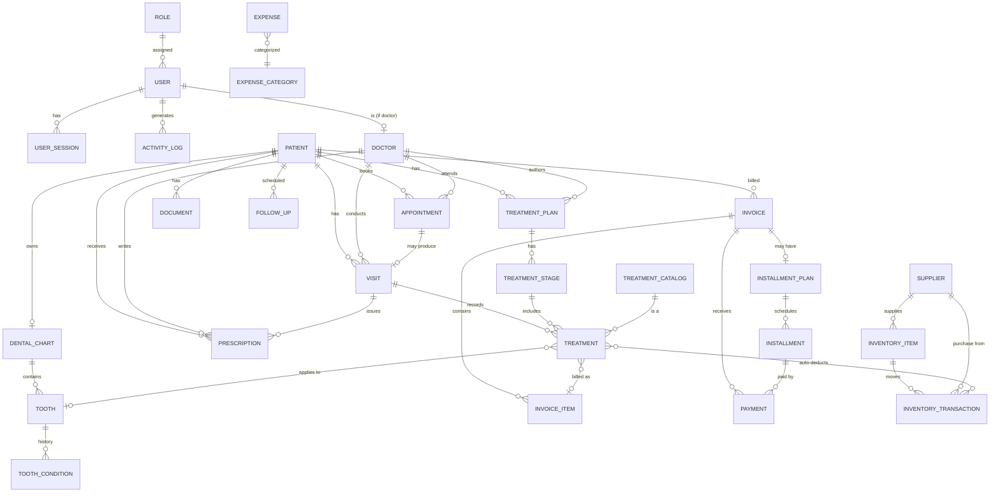

# Entity Relationship Diagram (ERD)

Normalized PostgreSQL schema. Rendered with Mermaid (GitHub displays it).



## Key entities & important fields

### accounts
- **Role** — `name`, `code`, `permissions` (JSON list of permission codes), `is_system`.
- **User** — `username`, `email`, `full_name`, `phone`, `role` (FK), `is_active`,
  `password` (Argon2), `last_login_ip`, timestamps.
- **UserSession** — `user`, `session_key`, `ip_address`, `user_agent`,
  `login_at`, `logout_at`, `is_active`.
- **Doctor** — `user` (1-1), `specialization`, `license_number`, `working_hours`,
  `is_active`.

### patients
- **Patient** — `code` (clinic ID), `full_name`, `gender`, `date_of_birth`,
  `phone`, `address`, `registration_date`, `emergency_contact_name/phone`,
  `medical_history`, `allergies`, `notes`, `photo`, `is_archived`. `age` derived.

### appointments
- **Appointment** — `patient`, `doctor`, `start`, `end`, `reason`,
  `status` (SCHEDULED/CONFIRMED/ARRIVED/COMPLETED/CANCELLED/NO_SHOW), `notes`.

### visits
- **Visit** — `patient`, `doctor`, `appointment` (nullable), `visit_date`,
  `visit_time`, `chief_complaint`, `clinical_findings`, `diagnosis`, `notes`,
  `queue_number`, `arrival_time`, `workflow_status`
  (WAITING/IN_CONSULTATION/TREATMENT_IN_PROGRESS/COMPLETED).

### dental_charts
- **DentalChart** — `patient` (1-1), `dentition` (ADULT/CHILD).
- **Tooth** — `chart`, `fdi_number`, `name`, `status` (HEALTHY/CARIES/FILLING/
  ROOT_CANAL/CROWN/BRIDGE/IMPLANT/EXTRACTION/ORTHODONTIC).
- **ToothCondition** — `tooth`, `condition`, `surface`, `note`, `recorded_by`,
  `recorded_at`, optional `treatment` link (per-tooth history).

### treatments
- **TreatmentCatalog** — `name`, `code`, `default_price`, `category`.
- **TreatmentPlan** — `patient`, `doctor`, `title`, `status`,
  `progress_percent`, `created_at`.
- **TreatmentStage** — `plan`, `order`, `name`, `status`.
- **Treatment** — `stage`, `catalog_item`, `visit`, `tooth`, `quantity`,
  `unit_price`, `status`, `clinical_notes`, `performed_at`.

### prescriptions
- **Prescription** — `patient`, `doctor`, `visit`, `notes`, `created_at`.
- **PrescriptionItem** — `prescription`, `medication`, `dosage`, `frequency`,
  `duration`, `notes`.

### billing
- **Invoice** — `number`, `patient`, `issued_by`, `issue_date`, `subtotal`,
  `discount`, `tax`, `total`, `paid_amount`, `balance`, `status`
  (UNPAID/PARTIAL/PAID).
- **InvoiceItem** — `invoice`, `treatment` (nullable), `description`,
  `quantity`, `unit_price`, `line_total`.
- **Payment** — `invoice`, `installment` (nullable), `amount`, `method`
  (CASH/BANK_TRANSFER), `received_by`, `paid_at`, `reference`.
- **InstallmentPlan** — `invoice`, `total_amount`, `number_of_installments`.
- **Installment** — `plan`, `due_date`, `amount`, `paid_amount`, `status`.

### expenses
- **ExpenseCategory** — `name` (Salaries/Utilities/Supplies/Rent/Maintenance/Other).
- **Expense** — `category`, `amount`, `date`, `description`, `recorded_by`.

### inventory
- **Supplier** — `name`, `phone`, `address`.
- **InventoryItem** — `name`, `category`, `unit`, `quantity`, `minimum_stock`,
  `supplier`, `unit_cost`.
- **InventoryTransaction** — `item`, `type` (IN/OUT), `quantity`, `unit_cost`,
  `reason`, `treatment` (nullable, auto-deduction), `created_by`, `created_at`.

### documents
- **Document** — `patient`, `type` (PHOTO/XRAY/OPG/PDF/LAB), `file`, `title`,
  `uploaded_by`, `uploaded_at`.

### followups
- **FollowUp** — `patient`, `due_date`, `type` (VISIT/PAYMENT), `note`,
  `status` (PENDING/DONE), `created_by`.

### audit
- **ActivityLog** — `user`, `action`, `entity`, `entity_id`, `summary`,
  `ip_address`, `created_at`.
```
